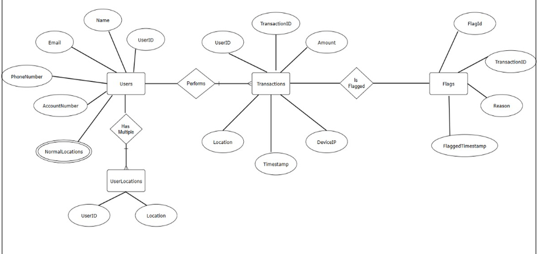

# Fraud Detection in Banking Transactions (SQL / MySQL)

A portfolio-ready, SQL-first project that flags suspicious banking transactions using **MySQL**.  
It includes a normalized schema, sample data, and production-style fraud detection queries.

## ✨ Features
- High-value transaction flagging
- Off-hours transaction detection
- Frequency spikes (rapid transactions per user)
- Repeated transactions to same merchant
- Spending anomalies vs user average
- Three-in-a-row **declined** attempts (consecutive detection using window functions)
- Top spenders & merchant aggregates
- (Optional) Location mismatch vs home location

## 🧱 Schema Overview
**Tables**  
- `Users(user_id, name, email, phone, address, user_home_location)`  
- `Transactions(transaction_id, user_id, amount, transaction_date, transaction_type, status, merchant_name, location, device_ip)`  
- `Flags(flag_id, transaction_id, flag_reason, flag_date)`

## 📦 Repository Structure
```
.
├── README.md
├── sql
│   ├── schema.sql
│   ├── sample_data.sql
│   └── fraud_detection_queries.sql
├── assets
│   └── ERD.png                
└── reports                    
    ├── PreliminaryReport.pdf
    ├── Proposal.pdf
    └── FinalReport.pdf
```

## 🚀 How to Run
1. Ensure MySQL 8+ is installed and running.
2. In MySQL Workbench (or CLI):
   - Run `sql/schema.sql`
   - Run `sql/sample_data.sql`
   - Run `sql/fraud_detection_queries.sql` (run queries one-by-one to view results)


## 🔎 Example Outcomes (with provided sample data)
- Flags high-value amounts `> 5000`
- Detects late-night transactions outside `09:00–21:00`
- Finds users with > 5 transactions in last 24h
- Surfaces 3 consecutive declines per user
- Lists top spenders and merchant totals

> Note: Sample data is synthetic and small—tune thresholds for your use case.

## 📝 Notes
- The `Flags` table is included for logging flagged transactions—feel free to automate inserts from query results.
- Indexes are added to speed up common detection patterns.
- For interviews: this repo demonstrates **DBMS design** + **SQL analytics** clearly without needing a full web app.

